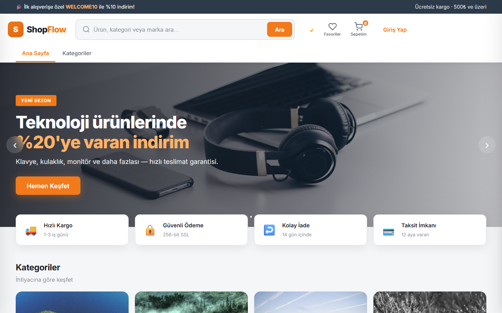
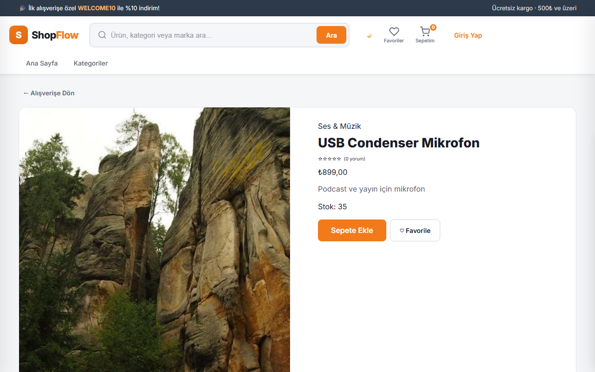
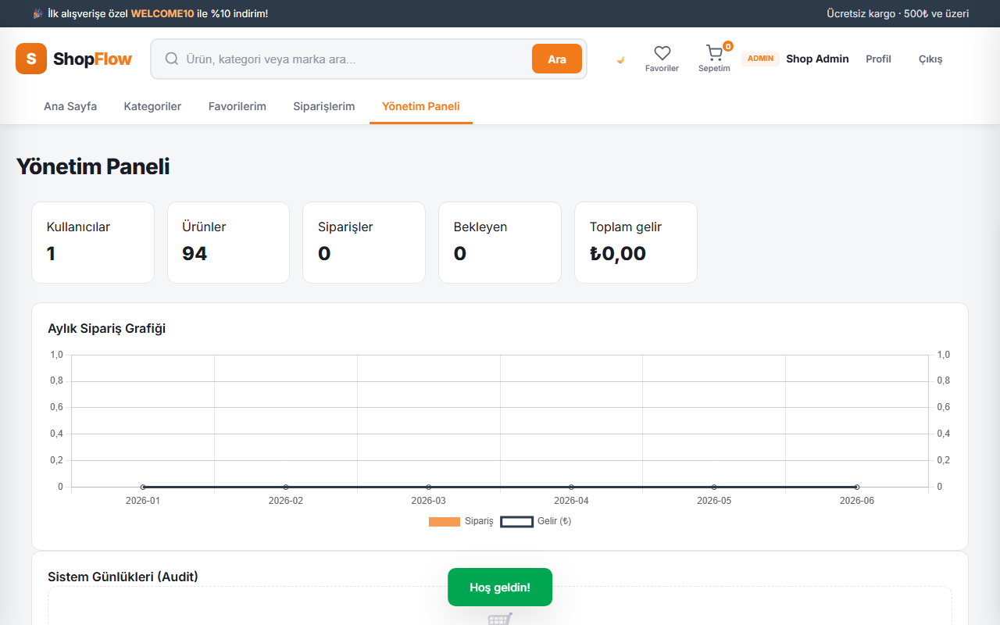
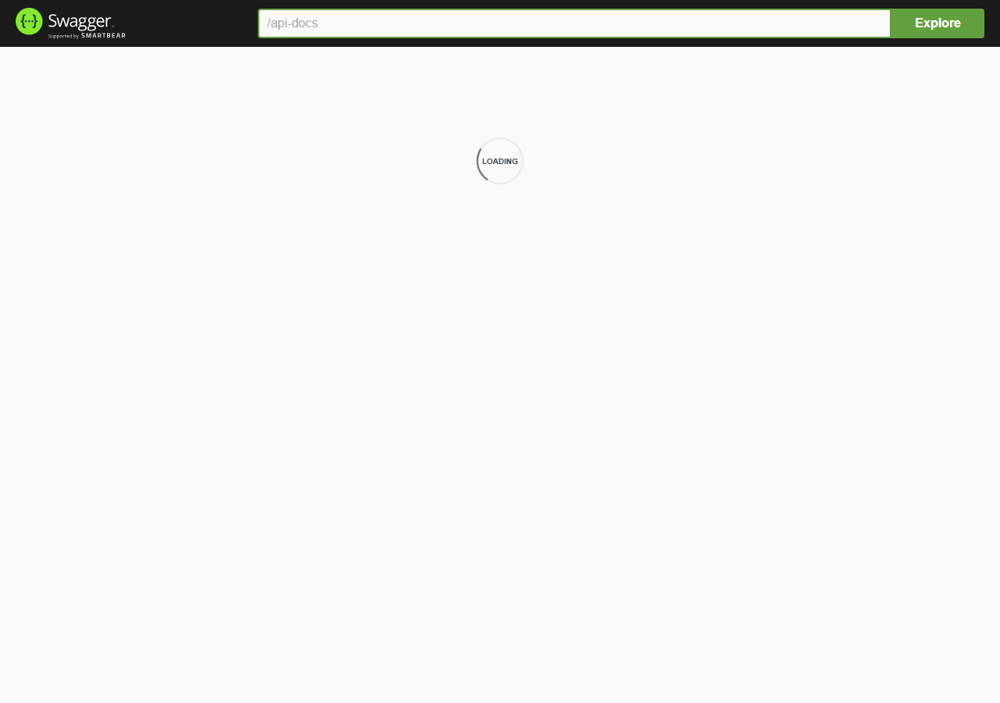
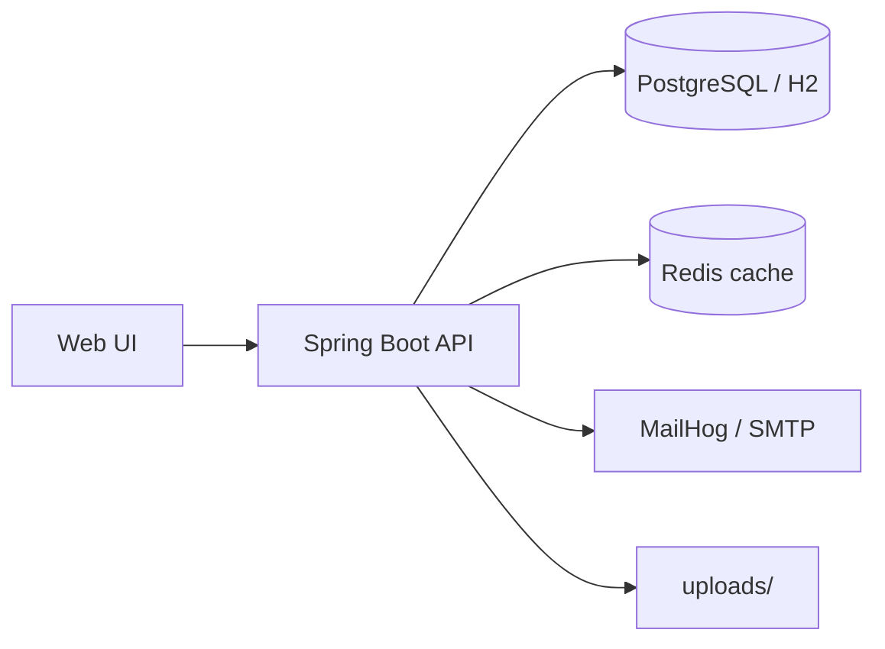

# ShopFlow E-Commerce API


[]()
[]()
[]()
[](https://github.com/sametozlu/javaproject/actions/workflows/ci.yml)
[](https://github.com/sametozlu/javaproject/actions/workflows/e2e.yml)

**Repo:** https://github.com/sametozlu/javaproject

**Canlı demo (Render):** https://shopflow-api.onrender.com — [Deploy rehberi](docs/DEPLOY.md)


Production-style e-commerce platform built with **Spring Boot 3** — REST API, JWT security, Flyway migrations, PostgreSQL, modern web UI, Docker, and CI. Designed for **portfolio and GitHub**.


## Screenshots

| Ana Sayfa | Ürün Detay |
|-----------|------------|
|  |  |

| Admin Panel | Swagger |
|-------------|---------|
|  |  |

Yeniden üretmek için: `.\scripts\capture-screenshots.ps1` (localhost:8080 çalışıyor olmalı).


## Highlights


| Area | Features |

|------|----------|

| **API** | JWT auth, roles, pagination, search, reviews, wishlist |

| **Commerce** | Cart, checkout, coupons, demo + **Stripe sandbox** ödeme, address book |

| **Orders** | Optimistic stock locking, shipping address, HTML emails |

| **Admin** | Dashboard, charts, audit logs, image upload, stock alerts |

| **Data** | Flyway V1–V5, seed data (94 ürün), Redis cache (prod) |

| **Ops** | Docker Compose, Render blueprint, Postman, GitHub Actions CI |

| **UI** | Mağaza, galeri, benzer ürünler, yorum, sepet, demo ödeme, sipariş detay, profil, tam admin panel |
| **Auth** | JWT + refresh token, password reset email |
| **Alerts** | Stock-back-in-stock subscription |


## Architecture



## Tech stack


- Java 17 · Spring Boot 3.4 · Spring Security · Spring Data JPA

- PostgreSQL / H2 · Flyway · JWT · SpringDoc OpenAPI · Mail (HTML)

- Redis · Docker · GitHub Actions


## Quick start


### Local (H2)


```bash

copy .env.example .env

.\mvnw.cmd spring-boot:run

```


| Resource | URL |

|----------|-----|

| **Web UI** | http://localhost:8080 |

| Swagger | http://localhost:8080/swagger-ui.html |

| Health | http://localhost:8080/actuator/health |

| MailHog | http://localhost:8025 (with docker) |


**Demo admin:** `admin@shop.com` / `admin123` (demo adres seeded)

**Ödeme:** Varsayılan **demo simülasyon** (4242… başarı, 4000… red). `.env` içine Stripe test anahtarları eklersen ödeme modalında **Stripe Sandbox** sekmesi açılır (`POST …/pay/stripe-intent` + Stripe.js).

**Sipariş e-postaları:** Admin siparişi `SHIPPED` / `DELIVERED` yapınca kullanıcıya HTML mail (MailHog / SMTP).


### Docker (PostgreSQL + Redis + MailHog)


```bash

docker compose up -d postgres redis mailhog

.\mvnw.cmd spring-boot:run "-Dspring-boot.run.profiles=prod"

```


### Deploy (Render)

1. Push repo to GitHub  
2. [Render](https://render.com) → **New Blueprint** → `render.yaml`  
3. Deploy bitince: **https://shopflow-api.onrender.com** (soğuk start ~1–2 dk)

Ayrıntılı adımlar: **[docs/DEPLOY.md](docs/DEPLOY.md)**


## API overview


| Method | Endpoint | Auth | Description |

|--------|----------|------|-------------|

| POST | `/api/auth/register` | Public | Register (+ refresh token) |

| POST | `/api/auth/login` | Public | Login |

| POST | `/api/auth/refresh` | Public | Refresh JWT |

| POST | `/api/auth/forgot-password` | Public | Password reset email |

| POST | `/api/auth/reset-password` | Public | Set new password |

| GET/PUT | `/api/users/me` | User | Profil görüntüle / güncelle (ad, şifre) |

| GET | `/api/products` | Public | Search (`q`, `categoryId`, `minPrice`, `maxPrice`) |

| POST | `/api/products/{id}/stock-alerts` | User | Back-in-stock alert |

| POST/PUT/DELETE | `/api/categories` | Admin | Category CRUD |

| GET | `/api/addresses` | User | List delivery addresses |

| POST | `/api/addresses` | User | Add address |

| GET | `/api/products/featured` | Public | Homepage featured products |
| GET | `/api/products/bestsellers` | Public | Top reviewed products |
| POST | `/api/coupons/validate` | Public | Validate coupon for cart total |
| POST | `/api/cart/checkout` | User | Checkout (requires `addressId`) |
| GET | `/api/payments/config` | Public | Stripe enabled + publishable key |
| POST | `/api/orders/{id}/pay/stripe-intent` | User | Stripe PaymentIntent |
| POST | `/api/orders/{id}/pay` | User | Demo pay or confirm Stripe |
| GET | `/api/orders/{id}` | User | Order detail + tracking number |

| POST | `/api/products/{id}/reviews` | User | Add review |

| POST | `/api/products/{id}/image` | Admin | Upload product image |

| GET | `/api/admin/audit-logs` | Admin | Audit trail |


Full API: Swagger UI or `docs/postman/ShopFlow.postman_collection.json`


Header: `Authorization: Bearer <token>`


## Configuration


Copy `.env.example` to `.env`. Key variables:


| Variable | Default | Description |

|----------|---------|-------------|

| `JWT_SECRET` | (dev default) | JWT signing key (32+ chars in prod) |

| `DB_*` | localhost/ecommerce | PostgreSQL (prod profile) |

| `REDIS_HOST` | localhost | Redis cache (prod) |

| `MAIL_HOST` | localhost | SMTP / MailHog |


## Tests


```bash

.\mvnw.cmd test

```

**E2E (Playwright):** Uygulama ayaktayken `cd scripts && npm install && npm run e2e` — veya GitHub Actions `e2e.yml`.


Includes auth, product listing, cart→checkout, payment, and admin ship status.


## Project structure


```

src/main/java/com/ecommerce/api/

├── config/       # Security, seed data, cache

├── controller/   # REST API (auth, products, cart, addresses, admin)

├── domain/       # JPA entities (Address, Order, Product @Version, AuditLog)

├── service/      # Business logic, HTML emails, stock reservation

src/main/resources/

├── db/migration/ # Flyway V1–V3

└── static/       # ShopFlow UI (HTML/CSS/JS)

docs/postman/     # Postman collection

```


## License


MIT — see [LICENSE](LICENSE).

